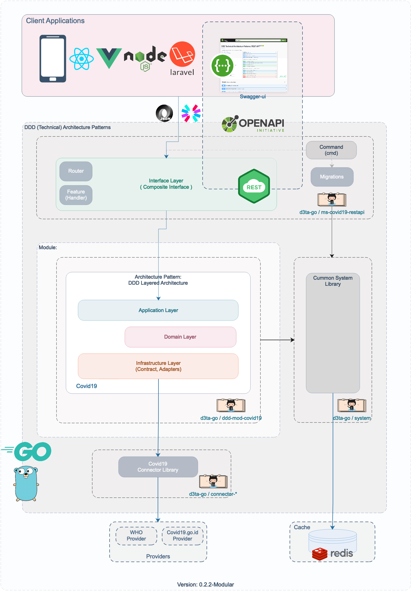

# ms-covid19-restapi

MicroService Interface/Presentation App: Covid19 RestAPI

As a part of `Simple Implementation of Modular DDD Technical Architecture Patterns in Go`.

## Diagram v 0.2.2-Modular



## Components

A. Interface Layer (MicroService)

1. Microservice: Covid19 REST API - using Echo Framework [ [d3ta-go/ms-covid19-restapi](https://github.com/d3ta-go/ms-covid19-restapi) ]

B. DDD Modules:

1. Covid19 - using DDD Layered Architecture (Contract, Adapters) [ [d3ta-go/ddd-mod-covid19](https://github.com/d3ta-go/ddd-mod-covid19) ]

C. Common System Libraries [ [d3ta-go/system](https://github.com/d3ta-go/system) ]:

1. Configuration - using yaml
2. Identity & Securities - using JWT, Casbin (RBAC)
3. Initializer
4. Email Sender - using SMTP
5. Handler
6. Migrations
7. Utils

D. Databases (Indirect)

1. MySQL (tested)
2. PostgreSQL (untested)
3. SQLServer (untested)
4. SQLite3 (untested)

E. Providers (Connectors) [ [d3ta-go/connector-\*](https://github.com/d3ta-go/connector-covid19) ]:

1. data.covid19.go.id (Official Covid19 Website - Indonesia)
2. covid19.who.it (Official Covid19 Website - WHO)

F. Persistent Caches

1. Session/Token/JWT Cache (Redis, File, DB, etc) [tested: Redis]

G. Messaging [to-do]

H. Logs [to-do]

### Development

1. Clone

```shell
$ git clone https://github.com/d3ta-go/ms-covid19-restapi.git
```

2. Setup

```
a. copy `conf/config-sample.yaml` to `conf/config.yaml`
b. copy `conf/data/test-data-sample.yaml` to `conf/data/test-data.yaml`
c. setup your dependencies/requirements (e.g: database, redis, smtp, etc.)
```

3. Runing on Development Stage

```shell
$ cd ms-covid19-restapi
$ go run main.go db migrate
$ go run main.go server restapi
```

4. Build

```shell
$ cd ms-covid19-restapi
$ go build
$ ./ms-covid19-restapi db migrate
$ ./ms-covid19-restapi server restapi
```

5. Distribution (binary)

Binary distribution (OS-arch):

- darwin-amd64
- linux-amd64
- linux-386
- windows-amd64
- windows-386

```shell
$ cd ms-covid19-restapi
$ sh build.dist.sh
$ cd dist/[OS-arch]/
$ ./ms-covid19-restapi db migrate
$ ./ms-covid19-restapi server restapi
```
